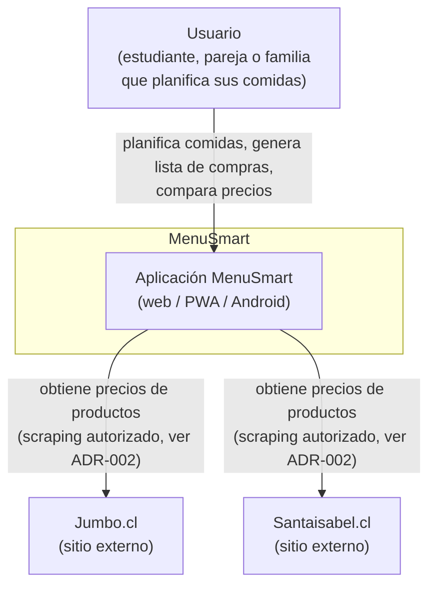
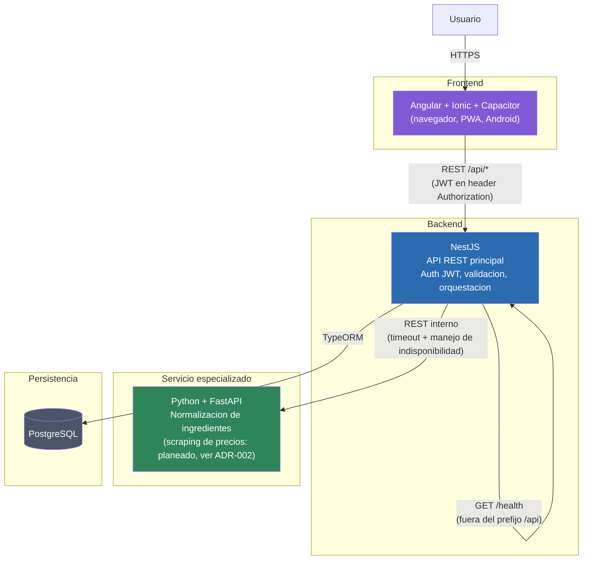
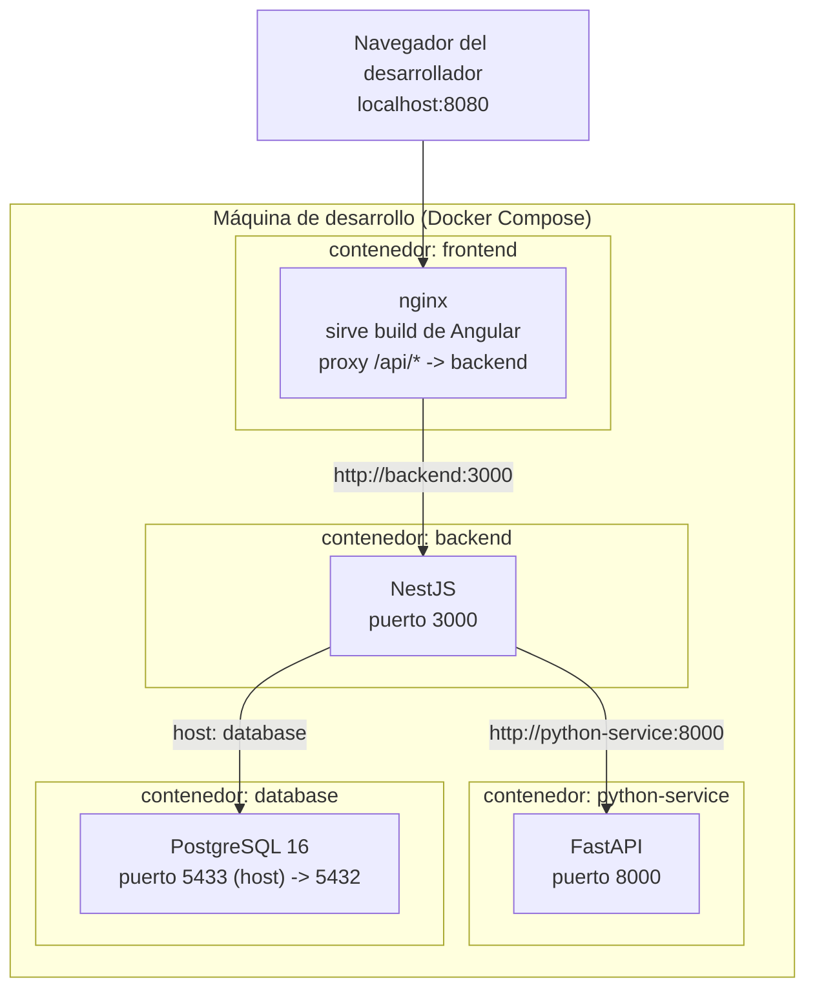
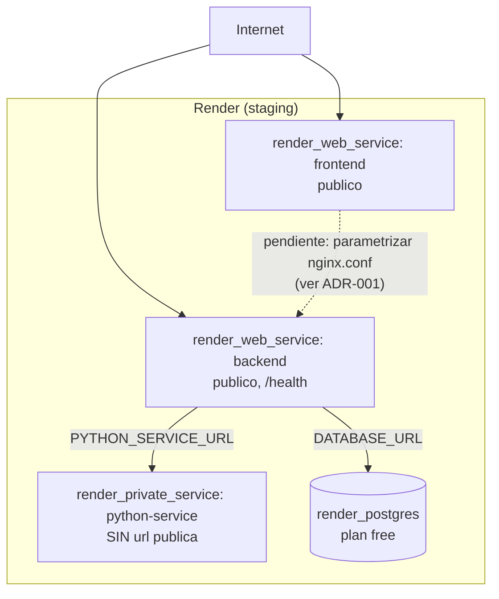

# Arquitectura de MenuSmart

## 1. Diagrama de contexto

Quién usa el sistema y con qué sistemas externos interactúa.

## 2. Diagrama de contenedores

Los 4 servicios que componen el sistema y cómo se comunican.

Reglas de comunicación (ver sección 3 del enunciado del curso):

- El frontend **nunca** llama directo al servicio Python ni a PostgreSQL — todo pasa por
  NestJS.
- El servicio Python **no modifica directamente** las tablas de NestJS; si necesita datos
  persistidos, los pide vía un endpoint interno de NestJS (no implementado aún — no ha sido
  necesario porque el servicio Python todavía no persiste nada por sí mismo).

## 3. Diagrama de despliegue

### Ambiente local (desarrollo, `docker-compose.yml`)

### Ambiente de staging (Render, ver `infra/` y ADR-001)

> **Nota:** el despliegue en Render todavía no se ha ejecutado (`terraform apply`
> pendiente, requiere una cuenta real). Este diagrama refleja lo que `terraform plan`
> generaría, no un ambiente ya corriendo.
