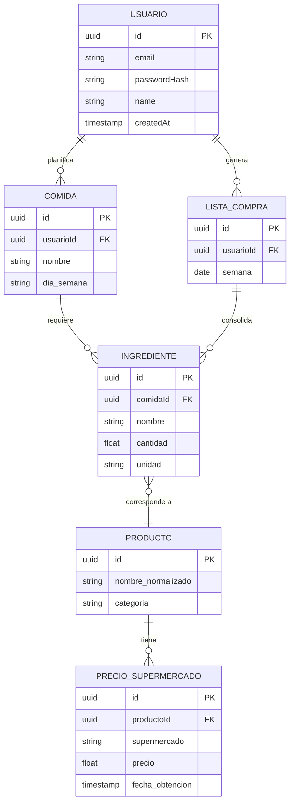
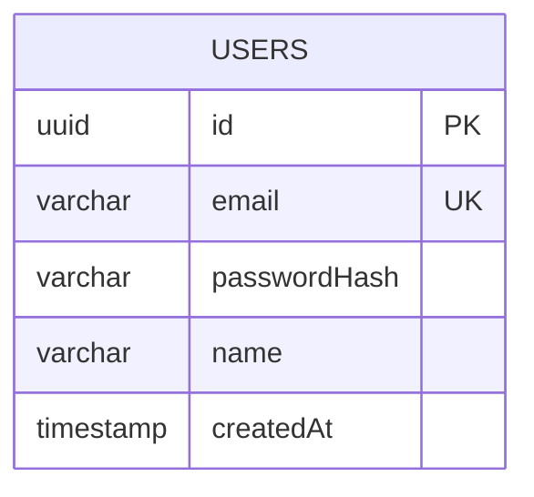

# Modelo de datos

## 1. Modelo conceptual (dominio completo planeado)

Entidades y relaciones que el producto necesita para cumplir su propósito completo
(planificación de comidas + comparación de precios). Algunas todavía no están
implementadas — se marca explícitamente cuáles.



**Estado de implementación:**

| Entidad | Estado |
|---|---|
| `USUARIO` | ✅ Implementada (`users` table, entrega actual) |
| `COMIDA` | ⏳ Planeada (Fase 6 / EP2) |
| `INGREDIENTE` | ⏳ Planeada — hoy existe solo como estructura de datos *en tránsito* (DTO) que recibe el servicio Python para normalizar, no persiste todavía |
| `PRODUCTO` | ⏳ Planeada (depende del scraping de precios, ver ADR-002) |
| `PRECIO_SUPERMERCADO` | ⏳ Planeada (depende del scraping de precios, ver ADR-002) |
| `LISTA_COMPRA` | ⏳ Planeada |

## 2. Modelo lógico (implementado hoy)



### Descripción de la tabla `users`

| Columna | Tipo | Restricciones |
|---|---|---|
| `id` | `uuid` | PK, `uuid_generate_v4()` |
| `email` | `varchar` | `UNIQUE`, `NOT NULL` |
| `passwordHash` | `varchar` | `NOT NULL` (hash bcrypt, nunca la contraseña en texto plano) |
| `name` | `varchar` | `NOT NULL` |
| `createdAt` | `timestamp` | `NOT NULL`, default `now()` |

Definida en `backend/src/users/entities/user.entity.ts`.

## 3. Estrategia de migraciones

- ORM: TypeORM, acceso vía `backend/src/data-source.ts`.
- Migraciones en `backend/src/migrations/`, versionadas en git.
- En **desarrollo** (`NODE_ENV != production`) se usa además `synchronize: true` para
  iterar rápido sobre entidades nuevas sin escribir una migración por cada cambio chico.
- En **producción** (`NODE_ENV=production`), `synchronize` se desactiva — el esquema real
  se rige únicamente por las migraciones, que corren automáticamente al arrancar el backend
  (`migrationsRun: true` en `backend/src/app.module.ts`).

Comandos disponibles (`backend/package.json`):

```bash
npm run migration:generate -- src/migrations/NombreDeLaMigracion
npm run migration:run
npm run migration:revert
```

## 4. Inicializar la base de datos

Con Docker Compose (recomendado, ver [README](../README.md)):

```bash
docker compose up -d database
```

Las migraciones corren solas al levantar el contenedor `backend` (no hace falta ningún
paso manual). Para desarrollo local sin Docker, ver las instrucciones de
`backend/README.md`.
