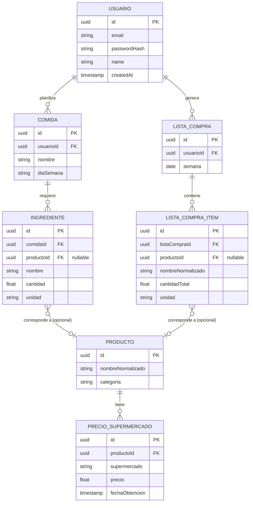
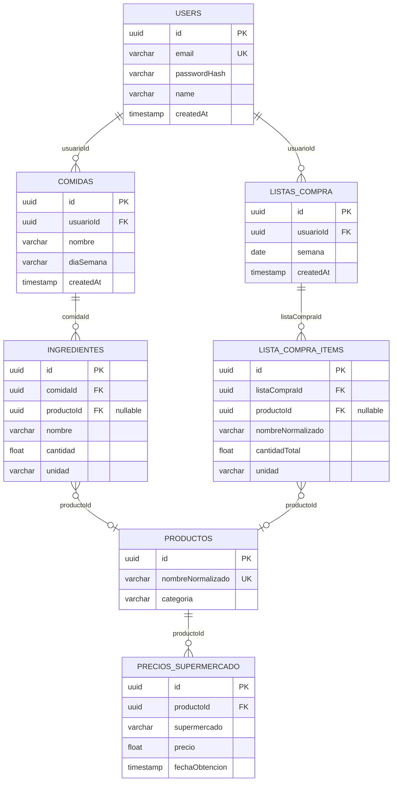

# Modelo de datos

## 1. Modelo conceptual (dominio completo planeado)

Entidades y relaciones que el producto necesita para cumplir su propósito completo
(planificación de comidas + comparación de precios). Algunas todavía no están
implementadas. Se marca explícitamente cuáles.



**Por qué `LISTA_COMPRA_ITEM` y no una relación directa `LISTA_COMPRA`↔`INGREDIENTE`:** una lista de
compras semanal debe consolidar ingredientes repetidos entre varias comidas (por ejemplo, "tomate"
usado en 3 comidas distintas debe aparecer una sola vez, con la cantidad sumada). Un `Ingrediente` no
puede pertenecer a la vez a una `Comida` y a una `ListaCompra`, así que `ListaCompraItem` es una
entidad propia, generada por un proceso de consolidación que recorre las comidas de la semana del
usuario y agrupa por ingrediente/producto. Esto es lo que sostiene la capacidad "adaptativa" de
optimización de compra exigida por el curso.

**Estado de implementación:**

| Entidad | Estado |
|---|---|
| `USUARIO` | ✅ Implementada (`users` table) |
| `COMIDA` | ✅ Esquema implementado (`comidas` table). Endpoints CRUD: Fase 6 |
| `INGREDIENTE` | ✅ Esquema implementado (`ingredientes` table), con FK opcional a `PRODUCTO`. Endpoints CRUD: Fase 6 |
| `PRODUCTO` | ✅ Esquema implementado (`productos` table). Se llena manualmente hasta que exista el scraper (ver ADR-002, EP2) |
| `PRECIO_SUPERMERCADO` | ✅ Esquema implementado (`precios_supermercado` table). Queda vacía hasta que exista el scraper (ver ADR-002, EP2) |
| `LISTA_COMPRA` | ✅ Esquema implementado (`listas_compra` table). Lógica de consolidación: Fase 6 |
| `LISTA_COMPRA_ITEM` | ✅ Esquema implementado (`lista_compra_items` table). Lógica de consolidación: Fase 6 |

## 2. Modelo lógico (implementado hoy)



### Descripción de las tablas

| Tabla | Columnas clave | Notas |
|---|---|---|
| `users` | `id` PK, `email` UK, `passwordHash`, `name`, `createdAt` | Hash bcrypt, nunca contraseña en texto plano |
| `comidas` | `id` PK, `usuarioId` FK → `users`, `nombre`, `diaSemana` | `onDelete: CASCADE` con `users` |
| `ingredientes` | `id` PK, `comidaId` FK → `comidas`, `productoId` FK → `productos` (nullable), `cantidad`, `unidad` | `productoId` es nulo hasta que el ingrediente se normaliza contra el catálogo |
| `productos` | `id` PK, `nombreNormalizado` UK, `categoria` | Catálogo normalizado; hoy se llena manualmente, el scraper (ADR-002, EP2) lo llenará automáticamente |
| `precios_supermercado` | `id` PK, `productoId` FK → `productos`, `supermercado`, `precio`, `fechaObtencion` | Vacía hasta que exista el scraper (EP2) |
| `listas_compra` | `id` PK, `usuarioId` FK → `users`, `semana` | Una fila por semana planificada por usuario |
| `lista_compra_items` | `id` PK, `listaCompraId` FK → `listas_compra`, `productoId` FK → `productos` (nullable), `cantidadTotal`, `unidad` | Resultado de consolidar ingredientes repetidos entre comidas de la semana (lógica de consolidación: Fase 6) |

Entidades definidas en `backend/src/users/entities/`, `backend/src/meals/entities/`,
`backend/src/products/entities/` y `backend/src/shopping-lists/entities/`.

## 3. Estrategia de migraciones

- ORM: TypeORM, acceso vía `backend/src/data-source.ts`.
- Migraciones en `backend/src/migrations/`, versionadas en git.
- En **desarrollo** (`NODE_ENV != production`) se usa además `synchronize: true` para
  iterar rápido sobre entidades nuevas sin escribir una migración por cada cambio chico.
- En **producción** (`NODE_ENV=production`), `synchronize` se desactiva. El esquema real
  se rige únicamente por las migraciones, que corren automáticamente al arrancar el backend
  (`migrationsRun: true` en `backend/src/app.module.ts`).

Comandos disponibles (`backend/package.json`):

```bash
npm run migration:generate -- src/migrations/NombreDeLaMigracion
npm run migration:run
npm run migration:revert
```

## 4. Inicializar la base de datos

Con Docker Compose (recomendado, ver [README](../README.md)):

```bash
docker compose up -d database
```

Las migraciones corren solas al levantar el contenedor `backend` (no hace falta ningún
paso manual). Para desarrollo local sin Docker, ver las instrucciones de
`backend/README.md`.
